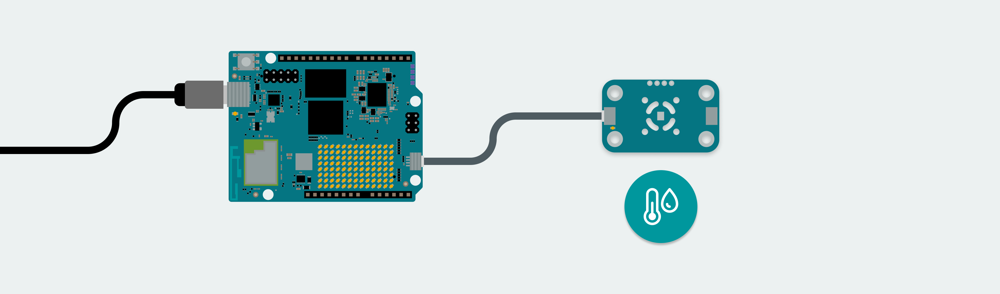
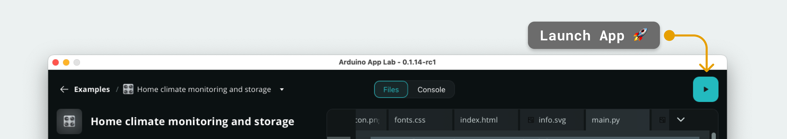
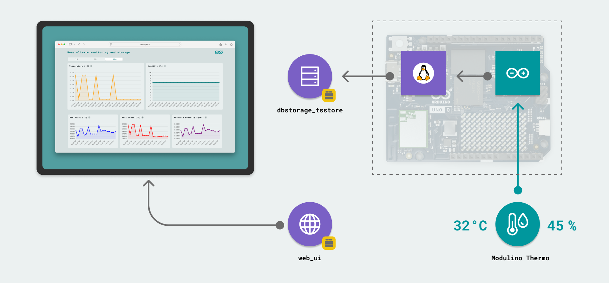

# Sensor Monitoring

The **Sensor Monitoring** example records:
Temperature & Humidity data from the [Modulino® Thermo](https://store.arduino.cc/products/modulino-thermo) node, and streams it to a web interface.
Measured Distance data from the [Modulino® Distance](https://store.arduino.cc/products/modulino-distance) node, and streams it to a web interface.
Movement X, Y, Z, Pitch, Roll, and Yaw data from the [Modulino® Movement](https://store.arduino.cc/products/modulino-distance) node, and streams it to a web interface.
Lux, Lux Calibrarion, & IR data from the [Modulino® Light](https://store.arduino.cc/products/modulino-light) node, and streams it to a web interface.

The data is stored on the board, where we can view the data from the latest 24 hour period.

Note: This work is a "borrowed" example mo@dified to be more educational.  Hope to add all the Modulino modules as well as many Grove Sensor.  The idea ist o have all the sensors operational which means just changing the GUI / UI and turning off the sensors not seened in whatever future application.  Restructured the code to be able to easily make conditional compiles etc.

Long term goal is to configure a publish / subscribe MQTT transport to allow for interfacng to Node Red to have more control on the dashboard.  Also am trying to port the GUI / Web UI over to a WIO Terminal.

## Bricks Used

- `dbstorage_tsstore` - makes it possible to save, read, and manage time-based data.
- `web_ui` - used to host a web server on the board, serving HTML, CSS & JavaScript files.

## Hardware and Software Requirements

### Hardware

- Arduino® UNO Q
- USB-C® cable
- [Modulino® Thermo](https://store.arduino.cc/products/modulino-thermo)
- [Modulino® Distance](https://store.arduino.cc/products/modulino-distance)
- [Modulino® Movement](https://store.arduino.cc/products/modulino-movement)
- [Modulino® Light](https://store.arduino.cc/products/modulino-light)  (* Borrowed a Ada Fruit module to get this working *)
- 4 Qwiic cable(s)

### Software

- Arduino App Lab

## How to Use the Example

1. Connect the board to a computer using a USB-C® cable.
2. Connect the Thermo, Distance, Movement, and Light Modulino® modules to the board using the Qwiic connectors.
    

3. Launch the App by clicking on the "Play" button in the top right corner. Wait until the App has launched.
    

4. Open a browser and access `<UNO-Q-IP-ADDRESS>:7000` (this may also launch automatically).
5. View the data from the Modulino® in real time!

## How it Works

This example uses the `dbstorage_tsstore` Brick to store data with time stamps on the board, and the `web_ui` Brick display the data on a web page.

The data is recorded from a Modulino® Thermo, connected to the UNO Q's Qwiic port, and sent to the Linux side using the **Bridge** tool.

As data is being stored, the web server can access the data, and render it in cool graphs, with possibility to check the data up to 24 hours back in time.

## Understanding the Code

The Sensor Monitoring example is a bit more advanced on the Python side, as it includes:
- A database for storing environmental data
- Calculations for the data received (e.g. calculating dew point, heat index & absolute humidity)
- An endpoint that makes it possible for the web server to fetch the latest data over HTTP.

### Linux (Python) Side

The `main.py` contains some advanced functions that makes the recording, storing and displaying of data possible.

- `Bridge.provide("record_sensor_samples", record_sensor_samples)` - data is received from the microcontroller.
- `def record_sensor_samples(celsius: float, humidity: float):` - the data is then stored using the `dbstorage_tsstore` Brick, as well as performing a series of calculations for retrieving e.g. absolute humidity.
- `def on_get_samples(resource: str, start: str, aggr_window: str):` - this function defines an API endpoint that lets us fetch the stored sensor data from the database.
- `ui.expose_api("GET", "/get_samples/{resource}/{start}/{aggr_window}", on_get_samples)` - the endpoint is exposed, making it available to the `web_ui` Brick. This allows the web server to pull in the latest data, as well as historical data.

>For better understanding the Python application, view the `main.py` file, which includes detailed comments for each code segment.

### Microcontroller (Sketch) Side

The microcontroller side is a bit easier to understand, where there are essentially three things happening:

- `float celsius = thermo.getTemperature();` - **temperature** is recorded from the Modulino®.
- `float humidity = thermo.getHumidity();` - **humidity** is recorded from the Modulino®.
- `Bridge.notify("record_sensor_samples", celsius, humidity);` - the data is sent to the Python application using the Bridge tool.
